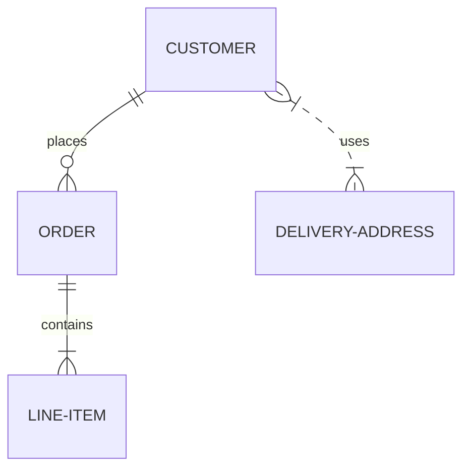
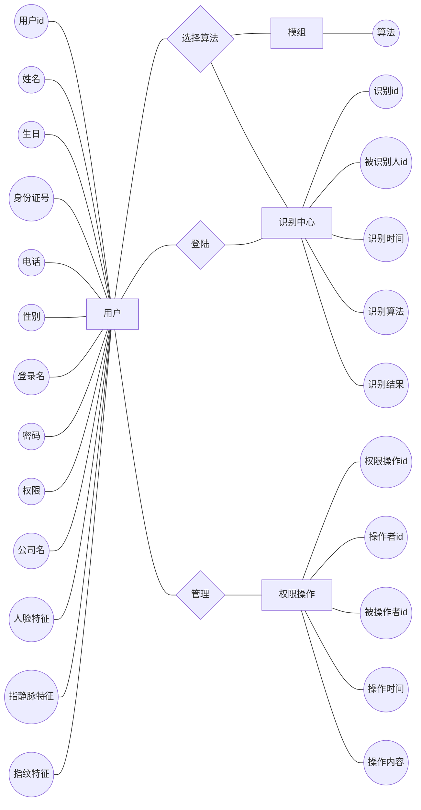

# 数据库系统

## 数据库模式

### 三级模式-两层映射

数据库设计过程

## ER模型

```mermaid
erDiagram
CUSTOMER ||--o{ ORDER : places
ORDER ||--|{ LINE-ITEM : contains
CUSTOMER }|..|{ DELIVERY-ADDRESS : uses
```

```mermaid
graph LR
A((用户id)) --- B[用户]
C((姓名)) --- B[用户]
D((生日)) --- B[用户]
E((身份证号)) --- B[用户]
F((电话)) --- B[用户]
G((性别)) --- B[用户]
H((登录名)) --- B[用户]
I((密码)) --- B[用户]
J((权限)) --- B[用户]
K((公司名)) --- B[用户]
W((人脸特征)) --- B
X((指静脉特征)) --- B
Y((指纹特征)) --- B
L[模组] --- M((算法))
Q[识别中心] --- R((识别id))
Q[识别中心] --- S((被识别人id))
Q[识别中心] --- T((识别时间))
Q[识别中心] --- U((识别算法))
Q[识别中心] --- V((识别结果))
a[权限操作 ]---b((权限操作id))
a --- c((操作者id))
a --- d((被操作者id))
a --- e((操作时间))
a --- f((操作内容))
B --- g{选择算法}
g --- L
B --- h{登陆}
h{登陆} --- Q
B --- i{管理}
i{管理} --- a
g --- Q
```

## 关系代数

## 规范化理论

## SQL语言

## 并发控制

## 数据库完整性约束
